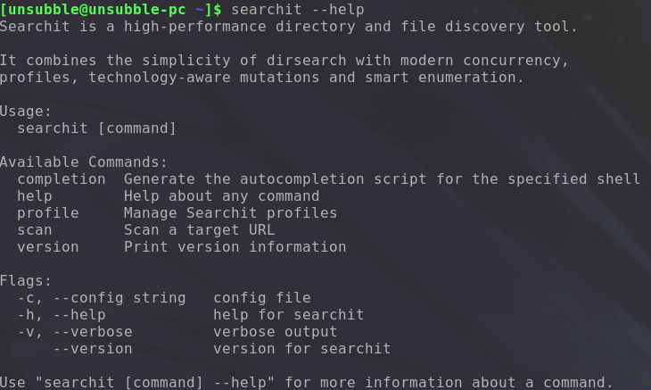
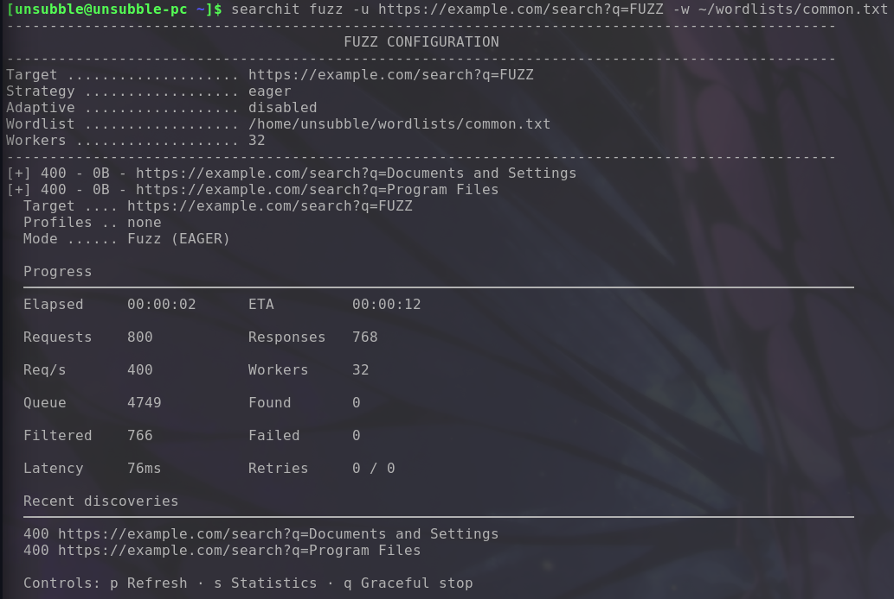
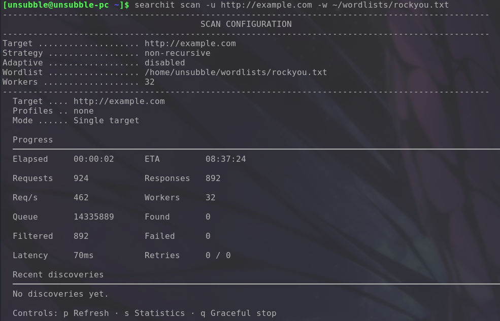
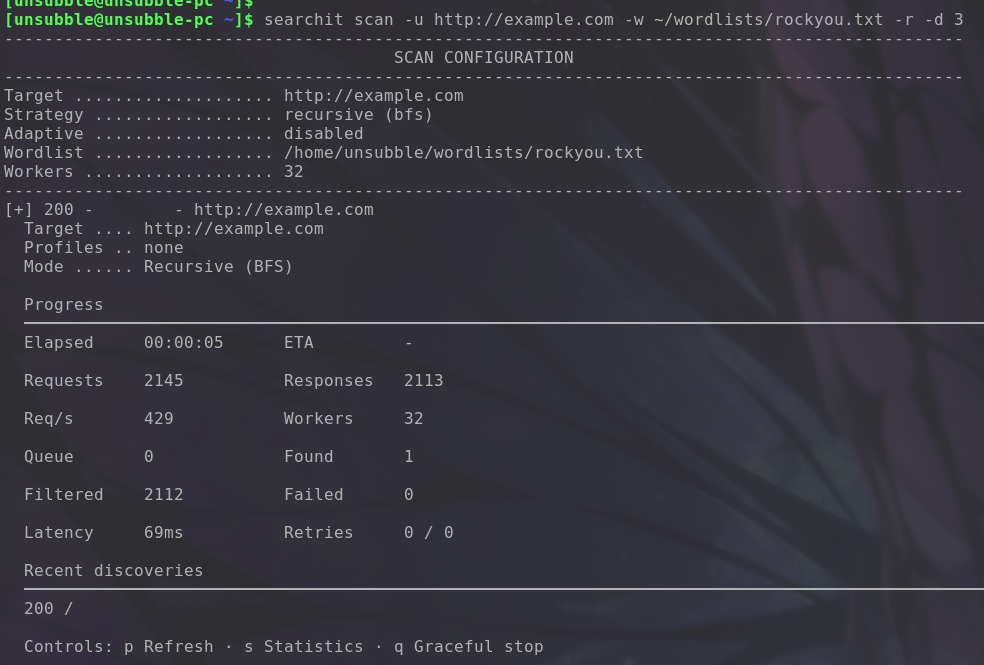
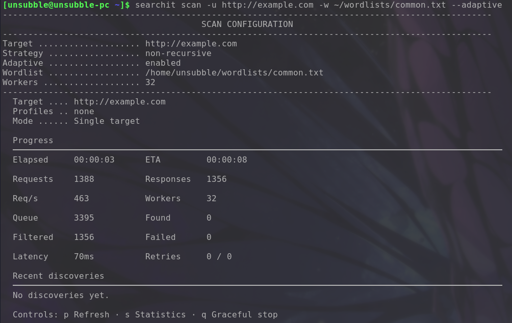
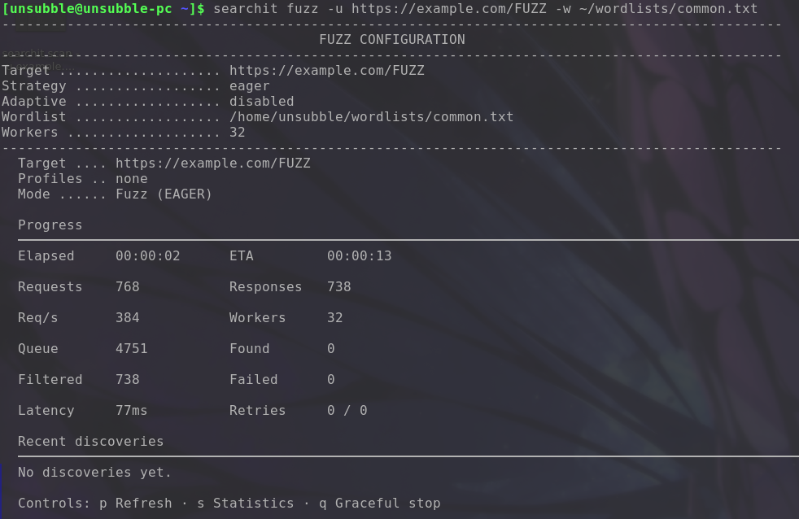
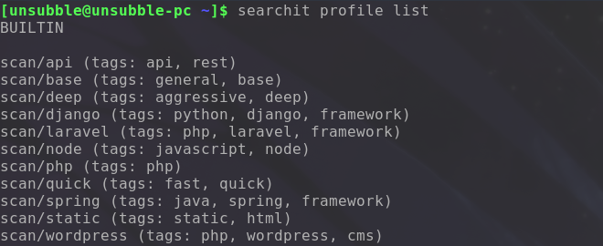

# Searchit


Searchit is a fast, flexible, and powerful web directory scanner and fuzzer. It helps you discover hidden paths, perform adaptive fuzzing, and analyze web applications with ease.



## Installation

You can build Searchit from source using Go or Make:

```bash
# Using Go
go build -o searchit main.go

# Using Make
make build
```

## Quick Start

**Scan a target for directories:**
```bash
searchit scan -u http://target.com/ -w common.txt
```

**Fuzz a parameter:**
```bash
searchit fuzz -u "http://target.com/page?id=FUZZ" -w common.txt
```



**List available profiles:**
```bash
searchit profile list
```

## Basic Scan

Discover directories and files on a web server.

```bash
searchit scan -u http://example.com -w ~/wordlists/rockyou.txt
```



## Recursive Scan

Discover directories deeply by setting a recursion depth.

```bash
searchit scan -u http://example.com -r --max-depth 3 -w ~/wordlists/rockyou.txt
```



## Adaptive Scan

Automatically detect the technology stack of the target and adaptively inject high-probability paths on the fly.

```bash
searchit scan -u http://127.0.0.1:8080 -w ~/wordlists/rockyou.txt --adaptive
```



## Basic Fuzzing

Fuzz request parameters, headers, and bodies seamlessly.

```bash
searchit fuzz -u http://127.0.0.1:8080/FUZZ -w ~/wordlists/rockyou.txt
```



## Profiles

Profiles allow you to bundle configurations, extensions, and targets for specific tasks (like WordPress or Laravel scanning).

```bash
searchit profile list
```



## Output Formats

Searchit supports various structured output formats for downstream pipeline integrations.

| Format | Description | Example Command |
|--------|-------------|-----------------|
| `text` | Plain text output | `--format text` |
| `json` | Single-line JSON | `--format json` |
| `ndjson`| Newline-delimited JSON | `--format ndjson` |
| `csv` | Comma-separated values | `--format csv` |
| `markdown` | Markdown table | `--format markdown` |

## Documentation

For more detailed documentation, check out the [docs/](docs/) directory.

## License

[MIT](LICENSE)
