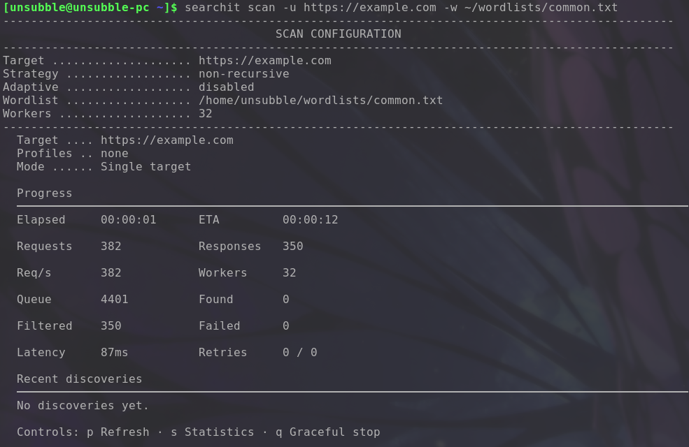

[Index](../../README.md) | [Getting Started](../getting-started.md) | [Command Reference](reference.md) | [Profiles Guide](../profiles/guide.md) | [Scanning Guide](../scanning/config.md) | [Keyboard Shortcuts](../keyboard-shortcuts.md)

# Command Reference

This document provides a complete reference for Searchit CLI commands and flags.

## Global Flags

Available across all subcommands:
* `--debug`: Enable debug output.
* `-v/--verbose`: Enable verbose output.

## `searchit scan`

The `scan` command is used for directory and file enumeration.

### Target Options
* `-u, --url`: Target URL to scan (can be provided multiple times, comma-separated values not supported here but you can provide multiple `-u`).
* `--url-file`: File containing a list of target URLs.
* `-w, --wordlist`: Wordlist to use for enumeration.

### Request Options
* `-X, --method`: HTTP method to use (default GET).
* `--data`: Data to send in the request body.
* `-H, --header`: Custom header to send with the request.
* `-b, --cookie`: Custom cookie to send with the request.
* `--request`: File containing a raw HTTP request.

### Execution Options
* `-t, --threads`: Number of concurrent threads (default 32).
* `--timeout`: Request timeout in seconds (int, default 10).
* `--connect-timeout`: Connection timeout (string, default "3s").
* `--rate`: Maximum requests per second.
* `--delay`: Delay between requests.

### Engine Options
* `-r, --recursive`: Enable recursive scanning.
* `-d, --max-depth`: Maximum recursion depth (uint16, default 3).
* `-s, --strategy`: Scanning strategy (bfs|dfs, default bfs).
* `--adaptive`: Enable adaptive scanning.
* `--recurse-on`: Status codes to recurse on (default 200,301,302,403).
* `--normalize-paths`: Normalize paths in URLs.
* `--collapse-slashes`: Collapse multiple slashes in paths.
* `--follow-redirects`: Follow HTTP redirects.
* `--max-redirects`: Maximum number of redirects to follow.

### Filtering Options
* `-e, --ext`: Extensions to append to wordlist items.
* `--mc`: Match status codes.
* `--fc`: Filter status codes.
* `--ms`: Match sizes.
* `--fs`: Filter sizes.
* `--mr`: Match regex in response.
* `--fr`: Filter regex in response.
* `--mt`: Match response time.
* `--ft`: Filter response time.
* `-x, --exclude-status`: Exclude status codes (default 404).
* `--include-size`: Include responses with this size.
* `--exclude-size`: Exclude responses with this size.
* `--include-header`: Include responses matching this header.
* `--exclude-header`: Exclude responses matching this header.

### Output Options
* `--show-headers`: Show headers in the output.
* `--show-title`: Show page titles in the output.
* `-o, --output`: Output file.
* `--format`: Output format (e.g., json, csv, markdown).
* `-q, --quiet`: Quiet mode (only show results).
* `--tech`: Detect and show technologies.
* `--no-progress`: Disable progress bar.

### Profile Options
* `--profile`: Load options from a profile.
* `--proxy`: Use a proxy for requests.

## `searchit fuzz`

The `fuzz` command is used for advanced fuzzing, replacing placeholders in requests.

### Target Options
* `-u, --url`: Target URL with placeholders (e.g., `FUZZ`).
* `-w, --wordlist`: Primary wordlist (maps to `FUZZ` placeholder).
* `--foo`: Wordlist mapped to the `FOO` placeholder.
* `--bar`: Wordlist mapped to the `BAR` placeholder.
* `--buzz`: Wordlist mapped to the `BUZZ` placeholder.

### Request Options
* `-X, --method`: HTTP method to use (default GET).
* `-d, --data`: Data to send in the request body.
* `-H, --header`: Custom header to send with the request.
* `-b, --cookie`: Custom cookie to send with the request.
* `--request`: File containing a raw HTTP request.

### Execution Options
* `-t, --threads`: Number of concurrent threads (default 32).
* `--timeout`: Request timeout in seconds (int, default 10).
* `--rate`: Maximum requests per second.
* `--delay`: Delay between requests.

### Engine Options
* `-s, --strategy`: Fuzzing strategy (eager|bfs|dfs, **default: eager**).
* `--adaptive`: Enable adaptive scanning.
* `--follow-redirects`: Follow HTTP redirects.
* `--max-redirects`: Maximum number of redirects to follow.

### Filtering Options
* `-e, --ext`: Extensions to append to wordlist items.
* `--mc`: Match status codes.
* `--fc`: Filter status codes.
* `--ms`: Match sizes.
* `--fs`: Filter sizes.
* `--mr`: Match regex in response.
* `--fr`: Filter regex in response.
* `--mt`: Match response time.
* `--ft`: Filter response time.
* `-x, --exclude-status`: Exclude status codes (default 404).
* `--include-size`: Include responses with this size.
* `--exclude-size`: Exclude responses with this size.

### Output Options
* `--show-headers`: Show headers in the output.
* `--show-title`: Show page titles in the output.
* `-o, --output`: Output file.
* `--format`: Output format.
* `-q, --quiet`: Quiet mode (only show results).
* `--no-progress`: Disable progress bar.

### Profile Options
* `--profile`: Load options from a profile.
* `--proxy`: Use a proxy for requests.

## `searchit profile`

The `profile` command manages configuration profiles.

### Subcommands
* `list`: List all available profiles.
* `show <profile>`: Display the configuration of a specific profile.
* `explain <profile>`: Explain how a profile was resolved (including inheritance).
* `graph <profile>`: Generate a visual dependency graph for a profile.
* `create <name>`: Create a new profile.
* `edit <profile>`: Edit an existing profile.
* `validate <profile|file>`: Validate a profile configuration.

## Keyboard Shortcuts

During an active scan or fuzz operation, you can use the following interactive shortcuts:

| Shortcut | Action | Description |
|---|---|---|
| `p` | Pause/Resume | Pauses or resumes the current execution |
| `s` | Stats | Prints current execution statistics |
| `q` | Stop Target | Stops the current target and moves to the next (if any) |
| `Ctrl+C` | Abort Everything | Aborts everything gracefully |
