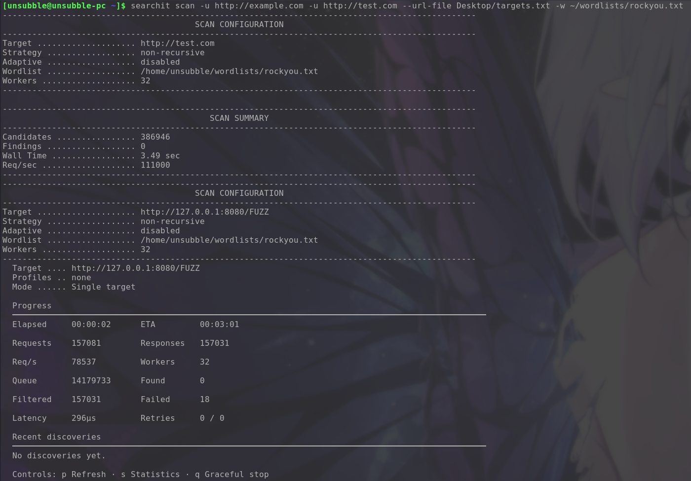
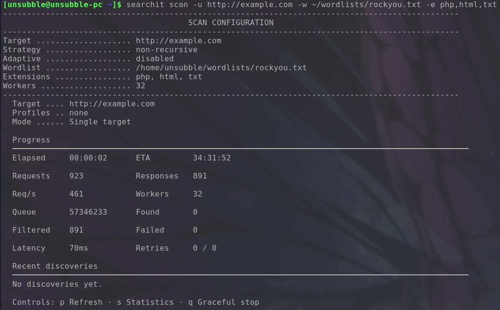
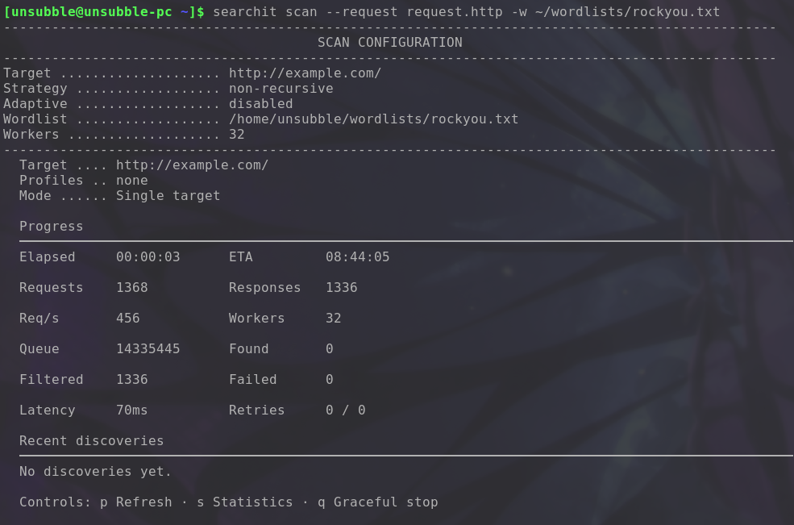
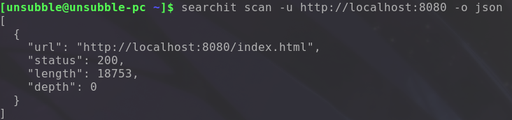
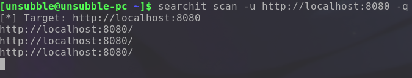
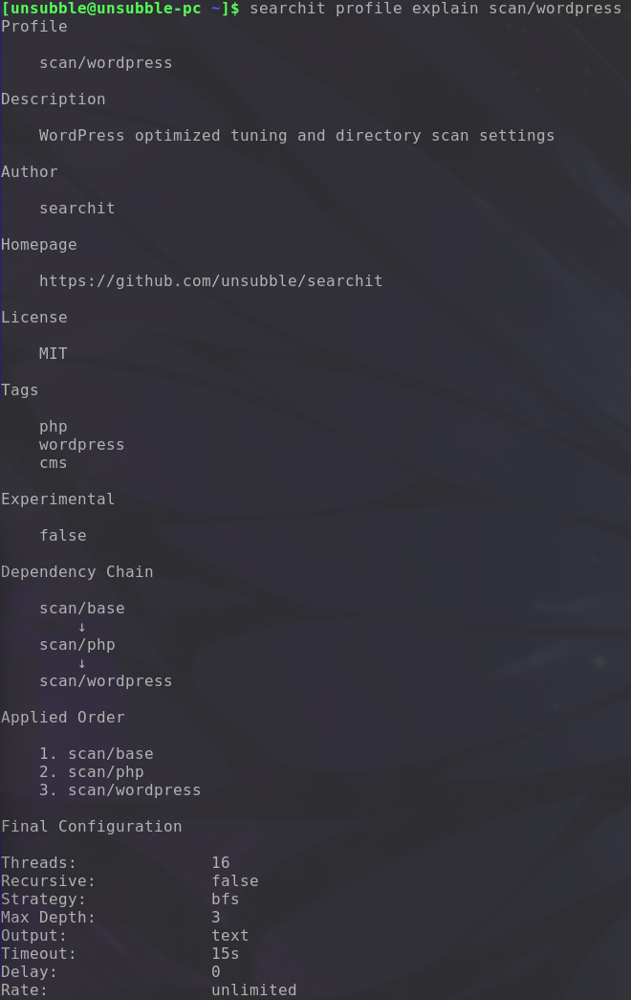

# Searchit Examples and Scenarios

This document provides practical examples and scenarios for using Searchit's `scan`, `fuzz`, and `profile` commands.

## Scan Examples

Here are common scenarios using the `scan` command:

1. **Basic scan**
   `searchit scan -u http://example.com -w ~/wordlists/rockyou.txt`
   Perform a basic directory and file enumeration against a single target.

   

2. **Recursive scan (depth 3)**
   `searchit scan -u http://example.com -w ~/wordlists/rockyou.txt -r -d 3`
   Enable recursion and limit it to a maximum depth of 3.

3. **Scan multiple targets**
   `searchit scan -u http://example.com -u http://test.com --url-file targets.txt -w ~/wordlists/rockyou.txt`
   Scan multiple targets provided via multiple `-u` flags and a file.

   

4. **Adaptive scan**
   `searchit scan -u http://example.com -w ~/wordlists/rockyou.txt --adaptive`
   Enable adaptive mode to automatically adjust to the server's behavior.

5. **Scan with profile**
   `searchit scan -u http://example.com --profile scan-extra/laravel`
   Run a scan using the pre-configured `scan-extra/laravel` profile.

6. **Scan with extensions**
   `searchit scan -u http://example.com -w ~/wordlists/rockyou.txt -e php,html,txt`
   Append `.php`, `.html`, and `.txt` to each word in the wordlist.

   

7. **Scan with request template**
   `searchit scan --request request.http -w ~/wordlists/rockyou.txt`
   Use a raw HTTP request from a file as the template.

   

8. **Scan with filters**
   `searchit scan -u http://example.com -w ~/wordlists/rockyou.txt --mc 200,301 --fc 404,500`
   Only match 200 and 301 status codes; filter out 404 and 500.

9. **Scan with size filter**
   `searchit scan -u http://example.com -w ~/wordlists/rockyou.txt --ms 100-500`
   Only match responses with a size between 100 and 500 bytes.

10. **Save output**
    `searchit scan -u http://example.com -w ~/wordlists/rockyou.txt -o results.json --format json`
    Save the scan results to `results.json` in JSON format. (You can also use CSV or Markdown).

    

11. **Quiet mode**
    `searchit scan -u http://example.com -w ~/wordlists/rockyou.txt -q | grep "admin"`
    Run quietly (showing only results) and pipe the output to `grep`.

    

12. **Slow/stealth scan**
    `searchit scan -u http://example.com -w ~/wordlists/rockyou.txt --rate 5 --delay 500ms`
    Limit the scan rate to 5 requests per second and add a 500ms delay between requests.

## Fuzz Examples

Here are common scenarios using the `fuzz` command:

13. **Basic path fuzzing**
    `searchit fuzz -u http://example.com/FUZZ -w ~/wordlists/rockyou.txt`
    Replace the `FUZZ` placeholder in the URL with items from the wordlist.

    

14. **URL parameter fuzzing**
    `searchit fuzz -u "http://example.com/api?id=FUZZ" -w numbers.txt`
    Fuzz a query string parameter.

    

15. **POST body fuzzing**
    `searchit fuzz -u http://example.com/login -X POST -d "user=FUZZ&pass=FUZZ" -w ~/wordlists/rockyou.txt`
    Fuzz multiple fields in a URL-encoded POST body.

16. **JSON body fuzzing**
    `searchit fuzz -u http://example.com/api -X POST -d '{"key":"FUZZ"}' -H 'Content-Type: application/json' -w ~/wordlists/rockyou.txt`
    Fuzz values inside a JSON POST body.

17. **Header fuzzing**
    `searchit fuzz -u http://example.com -H 'X-Custom-Header: FUZZ' -w ~/wordlists/rockyou.txt`
    Fuzz an HTTP header value.

18. **Cookie fuzzing**
    `searchit fuzz -u http://example.com -b 'session=FUZZ' -w ~/wordlists/rockyou.txt`
    Fuzz the value of a cookie.

19. **Multi-placeholder fuzzing**
    `searchit fuzz -u http://example.com/FUZZ?id=FOO&type=BAR -w paths.txt --foo ids.txt --bar types.txt`
    Use multiple placeholders and wordlists simultaneously.

20. **Fuzz with BFS strategy**
    `searchit fuzz -u http://example.com/FUZZ?id=FOO -w paths.txt --foo ids.txt --strategy bfs`
    Use the Breadth-First Search (BFS) combination strategy for multiple placeholders.

21. **Fuzz with request template**
    `searchit fuzz --request post_login.http -w ~/wordlists/rockyou.txt`
    Fuzz placeholders defined within a raw HTTP request template.

22. **Fuzz with adaptive mode**
    `searchit fuzz -u http://example.com/FUZZ -w ~/wordlists/rockyou.txt --adaptive`
    Enable adaptive behavior to filter out dynamic false positives.

23. **Fuzz with profile**
    `searchit fuzz -u http://example.com/FUZZ --profile fuzz/login`
    Apply settings and rules from a pre-configured profile.

## Profile Examples

Manage and understand your profiles with these commands:

24. **List all profiles**
    `searchit profile list`
    Display all available profiles.

25. **Explain profile inheritance**
    `searchit profile explain scan-extra/laravel`
    Show how a specific profile was resolved, including all inherited properties.

    

26. **Show profile dependency graph**
    `searchit profile graph scan-extra/laravel`
    Generate a visual representation of a profile's dependencies.

27. **Create custom profile**
    `searchit profile create my-custom-scan`
    Interactively create a new configuration profile.

28. **Use fuzz profile with CLI override**
    `searchit fuzz -u http://example.com/FUZZ --profile fuzz/login -t 100`
    Use a profile but override specific settings (like threads) via command line flags.
