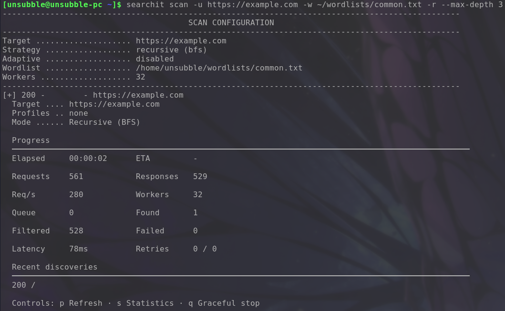

# Getting Started

[Index](../README.md) | [Getting Started](getting-started.md) | [Command Reference](commands/reference.md) | [Profiles Guide](profiles/guide.md) | [Scanning Guide](scanning/config.md) | [Keyboard Shortcuts](keyboard-shortcuts.md)

---

Welcome to Searchit, a fast, concurrent, profile-driven web content discovery and fuzzing tool.

## Installation

Searchit requires **Go 1.23 or higher**.

```bash
git clone https://github.com/unsubble/searchit.git
cd searchit
make build
```

The compiled executable is placed at `bin/searchit`. Install globally with:

```bash
make install
```

Or build directly with Go:

```bash
go build -o bin/searchit .
```

---

## Quick Start

### 1. Verify Installation

```bash
searchit --help
```


---

### 2. Basic Discovery Scan

Discover directories and files on a web server:

```bash
searchit scan -u https://example.com -w common.txt
```


---

### 3. Recursive Scan

Scan recursively up to depth 3, following discovered links:

```bash
searchit scan -u https://example.com -w common.txt -r --max-depth 3
```



---

### 4. Fuzz a URL Parameter or Path

Replace `FUZZ` in the URL with each word from your wordlist:

```bash
# Path fuzzing
searchit fuzz -u http://example.com/FUZZ -w common.txt

# Parameter fuzzing
searchit fuzz -u 'http://example.com/search?q=FUZZ' -w common.txt
```


> **Note**: `fuzz` accepts exactly one target. See [Fuzz Constraints](commands/reference.md#fuzz-target-constraint).

---

### 5. Scan with a Profile

Use a built-in profile for technology-specific scanning:

```bash
searchit scan -u http://example.com --profile scan-extra/laravel
```

List all available profiles:

```bash
searchit profile list
```


---

### 6. Adaptive Scanning

Let Searchit detect the target technology and prioritize relevant paths:

```bash
searchit scan -u http://example.com -w common.txt --adaptive
```


---

## Next Steps

| Resource | Description |
|---|---|
| [Command Reference](commands/reference.md) | All flags for `scan`, `fuzz`, and `profile` |
| [Profiles Guide](profiles/guide.md) | How to use and create profiles |
| [Scanning Guide](scanning/config.md) | Adaptive mode, recursion, extensions, filters |
| [Practical Examples](examples/scenarios.md) | 28 real-world usage examples |
| [Keyboard Shortcuts](keyboard-shortcuts.md) | Interactive TUI controls |
