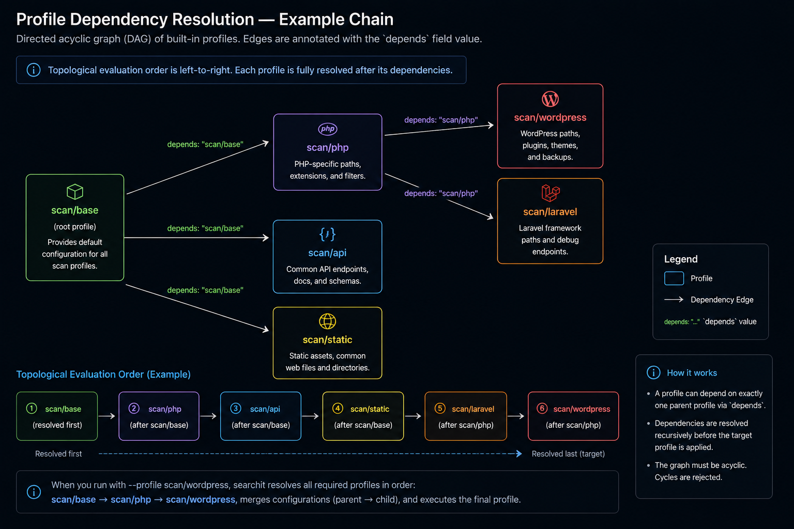
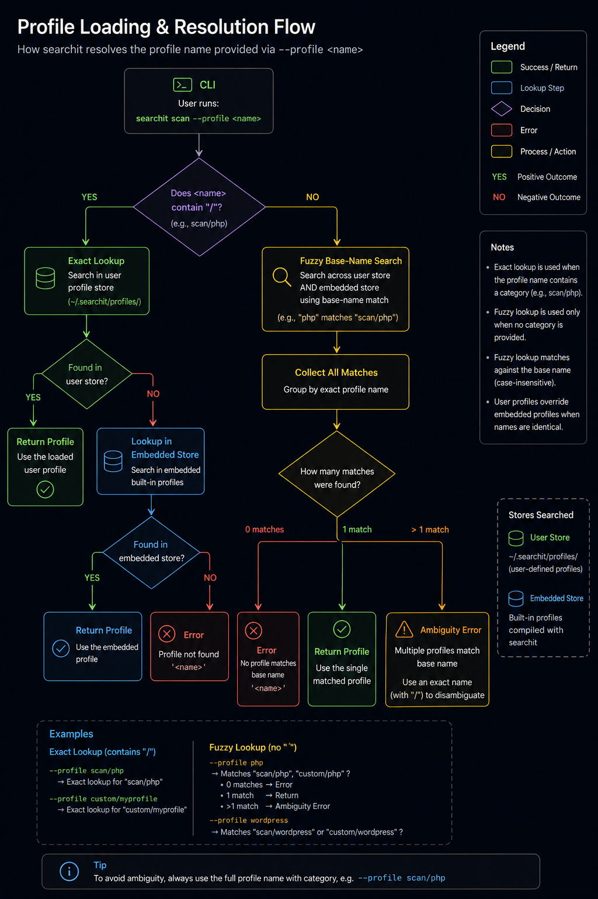
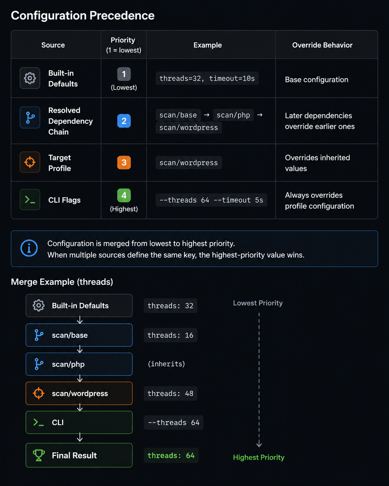

# Profiles Guide

[Index](../../README.md) | [Getting Started](../getting-started.md) | [Command Reference](../commands/reference.md) | [Profiles Guide](guide.md) | [Scanning Guide](../scanning/config.md) | [Architecture](../architecture/details.md) | [Standards](../development/standards.md) | [Roadmap](../../ROADMAP.md)

---

Profiles are reusable YAML configurations that bundle settings and metadata for `searchit scan` and `searchit fuzz`.

## Structure

A profile includes metadata and a tool-specific configuration block:

**Scan profile example:**

```yaml
schema: 1
name: scan/wordpress
tool: scan
description: WordPress optimized profile
author: searchit
license: MIT
homepage: https://github.com/unsubble/searchit
tags:
  - wordpress
depends:
  - php
config:
  threads: 16
  timeout: 15s
  exclude-status: "404,403,500"
```

**Fuzz profile example:**

```yaml
schema: 1
name: fuzz/login
tool: fuzz
description: Login form fuzzing preset
author: searchit
license: MIT
homepage: https://github.com/unsubble/searchit
tags:
  - login
  - post
config:
  threads: 16
  timeout: 15s
  method: POST
  data: "username=FUZZ&password=FUZZ"
  headers:
    - "Content-Type=application/x-www-form-urlencoded"
```

## Built-in Profile Overview

### Scan Profiles — Base (`scan/*`)

| Profile | Tags | Depends On | Threads | Timeout | Purpose |
|---------|------|------------|--------:|---------|---------|
| `scan/base` | default | — | 32 | 10s | Balanced profile suitable for most targets. |
| `scan/default` | general, default | — | 32 | 10s | Sane balanced defaults for general web content scanning. |
| `scan/quick` | fast | `scan/base` | 64 | 5s | Prioritizes scan speed with reduced request timeout. |
| `scan/deep` | recursive | `scan/base` | 32 | 15s | Optimized for deep recursive directory enumeration. |
| `scan/paranoid` | stealthy, slow | `scan/base` | 1 | 20s | Low-footprint scanning to avoid detection and rate limiting. |
| `scan/maniac` | aggressive | `scan/base` | 128 | 5s | Aggressive, high-concurrency recursive scanning. |
| `scan/lightspeed` | fast | `scan/base` | 256 | 3s | Extreme throughput scanning with minimal timeouts and high concurrency. |

### Scan Profiles — Extra (`scan-extra/*`)

| Profile | Tags | Depends On | Threads | Timeout | Purpose |
|---------|------|------------|--------:|---------|---------|
| `scan-extra/api` | api, rest | `scan/base` | 32 | 10s | Targets common REST API endpoints and documentation paths. |
| `scan-extra/graphql` | graphql, api | `scan/base` | 32 | 8s | GraphQL API endpoint scanning defaults. |
| `scan-extra/php` | php | `scan/base` | 32 | 10s | Focuses on common PHP applications, admin panels, and configuration files. |
| `scan-extra/wordpress` | wordpress, cms | `scan-extra/php` | 32 | 10s | WordPress-specific paths, plugins, themes, backups, and administrative endpoints. |
| `scan-extra/laravel` | laravel, php | `scan-extra/php` | 32 | 10s | Laravel framework files, debug endpoints, storage paths, and environment files. |
| `scan-extra/symfony` | php, symfony | `scan-extra/php` | 32 | 10s | Symfony web framework scanning defaults. |
| `scan-extra/django` | django, python | `scan/base` | 32 | 10s | Django administration, static assets, media, and common project files. |
| `scan-extra/rails` | ruby, rails | `scan/base` | 32 | 10s | Ruby on Rails web framework scanning defaults. |
| `scan-extra/spring` | spring, java | `scan/base` | 32 | 10s | Spring Boot actuator endpoints, documentation, and Java application resources. |
| `scan-extra/java` | java, jvm | `scan/base` | 32 | 15s | Java web application framework and servlet container scanning defaults. |
| `scan-extra/dotnet` | dotnet, iis | `scan/base` | 32 | 12s | .NET web application and IIS scanning defaults. |
| `scan-extra/node` | nodejs, javascript | `scan/base` | 32 | 10s | Common Node.js application files, package metadata, and framework-specific paths. |
| `scan-extra/nextjs` | nextjs, react | `scan-extra/node` | 32 | 10s | Next.js frontend and API route scanning defaults. |
| `scan-extra/express` | express, node | `scan-extra/node` | 32 | 10s | Express.js application backend scanning defaults. |
| `scan-extra/static` | static | `scan/base` | 64 | 5s | Optimized for static websites by focusing on assets and common web resources. |

### Fuzz Profiles — Base (`fuzz/*`)

Fuzz profiles are **use-case driven**. They preset the HTTP method, headers, and request body for common fuzzing scenarios without introducing new capabilities.

| Profile | Tags | Method | Threads | Timeout | Purpose |
|---------|------|--------|--------:|---------|---------|
| `fuzz/scan` | scan, discovery | GET | 32 | 10s | General-purpose path and resource fuzzing. Mirrors `searchit scan` defaults. |
| `fuzz/parameter` | parameter, query | GET | 32 | 10s | URL query parameter enumeration and injection. |
| `fuzz/content` | content, body, post | POST | 16 | 15s | Form body fuzzing with `application/x-www-form-urlencoded` content type. |
| `fuzz/login` | login, auth, post | POST | 16 | 15s | Login form credential fuzzing with `application/x-www-form-urlencoded`. |
| `fuzz/discovery` | discovery, enum | GET | 64 | 5s | Fast, high-concurrency discovery and path enumeration. |

### Fuzz Profiles — Extra (`fuzz-extra/*`)

| Profile | Tags | Method | Content-Type | Threads | Timeout | Purpose |
|---------|------|--------|--------------|--------:|---------|---------|
| `fuzz-extra/api` | api, rest | GET | — | 32 | 10s | REST API endpoint fuzzing with JSON `Accept` header. |
| `fuzz-extra/graphql` | graphql, api | POST | `application/json` | 16 | 15s | GraphQL query and introspection fuzzing. |
| `fuzz-extra/json` | json, api | POST | `application/json` | 16 | 15s | JSON body fuzzing for REST and JSON APIs. |
| `fuzz-extra/multipart` | multipart, upload | POST | `multipart/form-data` | 8 | 30s | Multipart form and file upload fuzzing. |
| `fuzz-extra/templates` | template, request | GET | — | 32 | 10s | Request template fuzzing companion preset. |

## Profile Resolution

Profiles can inherit configuration from other profiles using the `depends` field. Searchit resolves dependencies topologically, then merges configuration in dependency order before finally applying the target profile.

### Dependency Resolution

The dependency graph forms a directed acyclic graph (DAG). Dependencies are resolved before the target profile, ensuring that inherited configuration is available before overrides are applied.



### Relative Namespace Resolution

Relative dependency names automatically inherit the namespace of the parent profile.

For example, when `scan/wordpress` declares:

```yaml
depends:
  - php
```

the resolver automatically expands `php` to `scan/php`.

If the parent profile has no namespace (for example `myprofile`), relative dependency names are resolved as-is.

### Fuzzy Base-Name Lookup

When invoking a profile from the CLI without specifying a namespace (for example `--profile wordpress`), Searchit performs a fuzzy lookup across both user-defined and embedded profiles.

Resolution proceeds as follows:

- Search user profiles by base name.
- Search embedded profiles by base name.
- If no matches exist, return an error.
- If exactly one match exists, load that profile.
- If multiple matches exist, return an ambiguity error listing every candidate.



## Configuration Keys Reference

### Scan Profile Config Keys

The `config` block of a `scan` profile supports the following keys:

| Key | Type | Default | CLI Equivalent | Description |
|-----|------|---------|----------------|-------------|
| `wordlist` | string | Embedded wordlist | `-w`, `--wordlist` | Wordlist file to use for path generation. |
| `threads` | integer | `32` | `-t`, `--threads` | Number of concurrent worker goroutines. |
| `timeout` | duration | `10s` | `--timeout` | Overall HTTP request timeout. |
| `connect-timeout` | duration | `5s` | `--connect-timeout` | Maximum time allowed to establish a TCP connection. |
| `recursive` | boolean | `false` | `-r`, `--recursive` | Enable recursive directory enumeration. |
| `max-depth` | integer | `3` | `-R`, `--max-depth` | Maximum recursion depth. |
| `strategy` | string | `bfs` | `--strategy` | Recursion strategy (`bfs` or `dfs`). |
| `delay` | duration | `0ms` | `--delay` | Delay inserted between requests made by each worker. |
| `rate` | integer | Unlimited | `--rate` | Maximum requests per second. |
| `output` | string | `text` | `-o`, `--output` | Output formatter (`text`, `json`, or `ndjson`). |
| `quiet` | boolean | `false` | `-q`, `--quiet` | Suppress informational output and only emit results. |
| `normalize-paths` | boolean | `true` | `--normalize-paths` | Normalize generated paths before dispatching requests. |
| `collapse-slashes` | boolean | `true` | `--collapse-slashes` | Collapse repeated `/` characters in generated URLs. |
| `exclude-status` | string / list | — | `-x`, `--exclude-status` | Ignore matching HTTP status codes. Supports lists, ranges, and wildcards. |
| `recurse-on` | string / list | `200,301,302,403` | `--recurse-on` | Status codes that trigger recursive scanning. |
| `include-size` | string | — | `--include-size` | Only accept responses whose body size matches the specified filter. |
| `exclude-size` | string | — | `--exclude-size` | Exclude responses whose body size matches the specified filter. |
| `include-header(s)` | string / list | — | `--include-header` | Require one or more response headers to match before accepting a result. Supports both `include-header` and `include-headers` in YAML. |
| `exclude-header(s)` | string / list | — | `--exclude-header` | Reject responses matching one or more response header filters. Supports both `exclude-header` and `exclude-headers` in YAML. |

### Fuzz Profile Config Keys

The `config` block of a `fuzz` profile supports the following keys:

| Key | Type | Default | CLI Equivalent | Description |
|-----|------|---------|----------------|-------------|
| `threads` | integer | `32` | `-t`, `--threads` | Number of concurrent fuzzing workers. |
| `timeout` | duration | `10s` | `--timeout` | Overall HTTP request timeout. |
| `connect-timeout` | duration | `5s` | `--connect-timeout` | Maximum time to establish a TCP connection. |
| `delay` | duration | `0ms` | `--delay` | Delay inserted between requests per worker. |
| `rate` | integer | Unlimited | `--rate` | Maximum requests per second across all workers. |
| `method` | string | `GET` | `-X`, `--method` | HTTP method to use for all fuzz requests. |
| `data` | string | — | `-d`, `--data` | Request body template. Supports `FUZZ`, `FOO`, `BAR`, `BUZZ` placeholders. |
| `headers` | string / list | — | `-H`, `--header` | Custom request headers. Supports `Name=Value` format and placeholders. |
| `cookies` | string / list | — | `-b`, `--cookie` | Custom request cookies. Supports `Name=Value` format and placeholders. |
| `request` | string | — | `--request` | Path to a raw HTTP request template file. |
| `output` | string | `text` | `-o`, `--output` | Output formatter (`text`, `json`, or `ndjson`). |
| `quiet` | boolean | `false` | `-q`, `--quiet` | Suppress informational output and only emit results. |

> **Note**: CLI flags always take precedence over profile-defined values. Any flag explicitly passed on the command line overrides the corresponding profile setting.

## Configuration Precedence

When the same configuration key is defined in multiple places, Searchit merges configuration from lowest to highest priority. Later sources override earlier ones.

| Source | Priority | Example |
|--------|:--------:|---------|
| Built-in defaults | 1 (Lowest) | `threads: 32`, `timeout: 10s` |
| Resolved dependency chain | 2 | `scan/base` → `scan/php` → `scan/wordpress` |
| Target profile | 3 | Values defined directly in `scan/wordpress` |
| CLI flags | 4 (Highest) | `--threads 64 --timeout 5s` |

> **Note**
>
> Configuration is applied from lowest to highest priority. When multiple sources define the same key, the highest-priority value wins.
>
> Example:
>
> - Built-in defaults: `threads: 32`
> - `scan/base`: `threads: 16`
> - `scan/php`: *(inherits unchanged)*
> - `scan/wordpress`: `threads: 48`
> - CLI: `--threads 64`
>
> **Final value:** `64`




## Operations

Once a profile exists, the following commands can be used to inspect, validate, visualize, and edit it.

### Creating a Profile

Create a skeleton profile in the user configuration directory:

```bash
searchit profile create scan/myprofile
```

### Validating a Profile

Validate profile metadata and scan configuration using either a registered profile name or a local YAML file:

```bash
searchit profile validate scan/myprofile
searchit profile validate ./myprofile.yaml
```

### Visualizing Dependency Tree

```bash
searchit profile graph scan/wordpress
```


### Explaining Override Merges

Analyze how configuration is inherited and overridden throughout the dependency chain:

```bash
searchit profile explain scan/wordpress
```


### Safe Editing

Open the profile in the system editor (for example `nano` or `vim`). Changes are written to a temporary file first and replace the original profile only after validation succeeds.

```bash
searchit profile edit scan/myprofile
```

---

## Using Fuzz Profiles

Apply a built-in fuzz profile with the `--profile` flag:

```bash
# Use the login preset (POST, 16 threads, 15s timeout)
searchit fuzz \
  -u https://example.com/login \
  --FUZZ passwords.txt \
  --profile fuzz/login

# Use the GraphQL extra preset (POST, JSON content-type)
searchit fuzz \
  -u https://example.com/graphql \
  --FUZZ queries.txt \
  --profile fuzz-extra/graphql

# Fast discovery fuzzing (64 threads, 5s timeout)
searchit fuzz \
  -u https://example.com/FUZZ \
  -w paths.txt \
  --profile fuzz/discovery

# Profile + CLI override: profile sets POST but CLI switches to PUT
searchit fuzz \
  -u https://example.com/api/FUZZ \
  -w words.txt \
  --profile fuzz/login \
  -X PUT \
  --threads 32
```

> **Tip**: CLI flags always override the corresponding profile setting.
> Passing `--threads 32` on the command line wins over any `threads` value in the profile.

### Creating a Custom Fuzz Profile

```bash
searchit profile create fuzz/myprofile
```

This creates a skeleton fuzz profile. Validate it before use:

```bash
searchit profile validate fuzz/myprofile
searchit profile validate ./myfuzz.yaml
```
