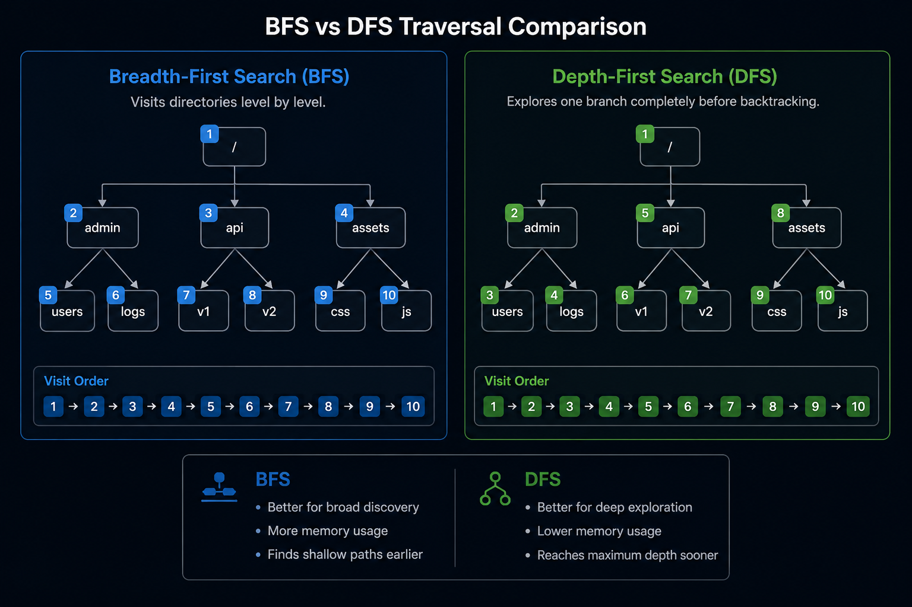
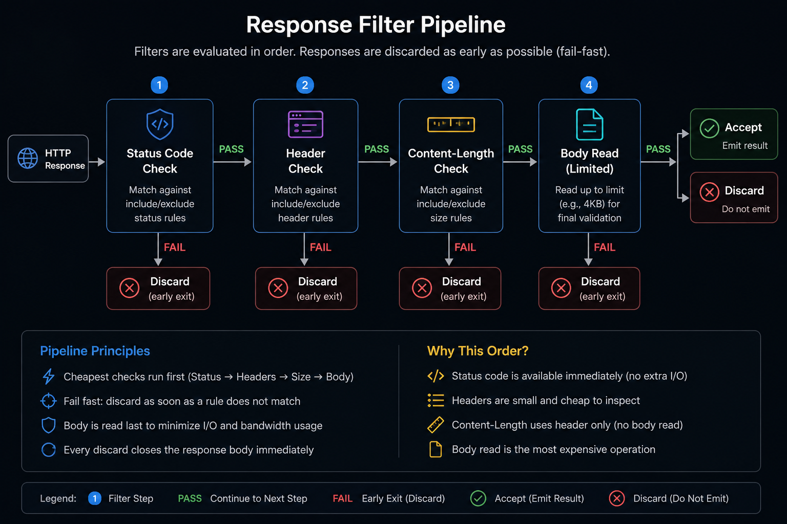
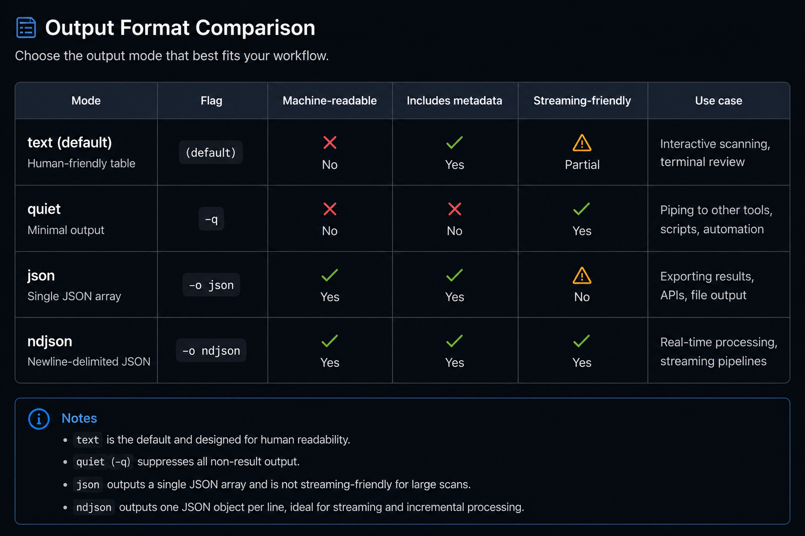

# Scan Configuration

[Index](../../README.md) | [Getting Started](../getting-started.md) | [Command Reference](../commands/reference.md) | [Profiles Guide](../profiles/guide.md) | [Scanning Guide](config.md) | [Architecture](../architecture/details.md) | [Standards](../development/standards.md) | [Roadmap](../../ROADMAP.md)

---

## Recursion

Searchit supports recursive discovery of subdirectories using two strategies:
- **BFS (Breadth-First Search)**: Scans all directories at the current level before going deeper.
- **DFS (Depth-First Search)**: Crawls as deep as possible along a branch before backtracking.



Configuring recursion:
```bash
searchit scan -u https://example.com -r -d 3 -s bfs
```

## Response Filtering

Filters are applied in a strict, low-cost pipeline to discard unwanted HTTP responses:
- **Status Filter**: Ignore responses matching status codes (e.g. `-x 404,500`).
- **Header Filter**: Match custom HTTP headers case-insensitively using `-H Name=Value` (include) or `--exclude-header Name=Value` (exclude).
- **Content-Length Filter**: Match response body size bounds using `--include-size` or `--exclude-size`.



## Rate Limiting and Delays

To avoid overwhelming target servers, you can limit throughput:
- `--rate <req/s>`: Restrict the maximum request rate.
- `--delay <duration>`: Insert a fixed sleep interval between worker requests (e.g. `--delay 100ms`).



## Interactive Live Progress Display & Keyboard Controls

The live progress display is **enabled automatically** whenever stdout is an interactive terminal (TTY). No flag is required.

```bash
searchit scan -u https://example.com
```

Progress is suppressed automatically when:
- stdout is not a terminal (piped output, redirected to a file, or CI environment)
- `--quiet` / `-q` is active
- `--output json` or `--output ndjson` is set

To explicitly disable progress in an interactive terminal, pass `--no-progress`:

```bash
searchit scan -u https://example.com --no-progress
```


Interactive controls during scans (when run in an active terminal environment):
- `p`: Force-redraw the progress interface.
- `s`: Print extended statistics.
- `q`: Gracefully stop execution.
