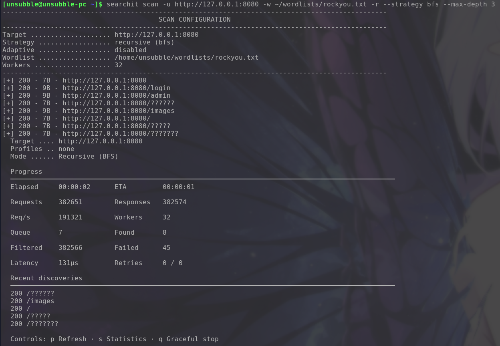

# Recursion & Determinism Hardening Guide

[Index](../../README.md) | [Getting Started](../getting-started.md) | [Command Reference](../commands/reference.md) | [Profiles Guide](../profiles/guide.md) | [Scanning Guide](config.md) | [Recursion Guide](recursion.md)

---

Searchit features a highly performant and hardened recursion subsystem. It is designed to safely, reliably, and deterministically discover nested directory structures and crawling links on target servers.

## Traversal Strategies

Searchit supports two directory traversal strategies:

- **BFS (Breadth-First Search)**: Explores directories level-by-level (e.g. root paths first, then all nested subdirectories at depth 1, then depth 2). This is the default strategy.
- **DFS (Depth-First Search)**: Prioritizes deeper directory hierarchies first, crawling down a branch as far as possible before backtracking to siblings.

Traversal is enabled using the `-r` or `--recursive` flag. You can set the strategy via `--strategy bfs` or `--strategy dfs`, and enforce a limit using `-R` or `--max-depth <depth>`.

```bash
searchit scan -u http://127.0.0.1:8080 -w ~/wordlists/rockyou.txt -r --strategy bfs --max-depth 3
```



---

## HTML Link Extraction & Crawling

During recursive scanning, Searchit automatically parses HTML response bodies to discover and crawl internal links:

- **Parsed Tags**: `a[href]`, `link[href]`, `script[src]`, `img[src]`, `form[action]`.
- **Filtering**: Automatically discards fragment links (`#`), `javascript:`, `mailto:`, and `tel:` URIs.
- **Frontier Enqueuing**: Discovered internal paths are enqueued into the recursion frontier under `OriginHTML` with depth tracking.

---

## Determinism Across Worker Counts

One of Searchit's core design principles is **strict determinism**.

Regardless of the number of concurrent worker threads allocated via `-t/--threads` (from 1 to 256), a given scan target and configuration **must produce exactly the same result set**.

### What Is Checked for Determinism?

Searchit's hardening test matrix validates and enforces that the following properties match perfectly across all worker counts:
1. **URL count**: The total number of discovered endpoints.
2. **URL ordering**: The canonical sorted list of discovered URLs.
3. **Recursion depth**: The depth at which each URL was discovered.
4. **Duplicates**: Ensuring duplicate suppression works identically under high concurrency.
5. **Output formatters**: Text, JSON, NDJSON, CSV, and Markdown outputs are validated to be character-for-character identical after sorting.
6. **Profile behavior**: Config overrides and dependency merges remain identical.

